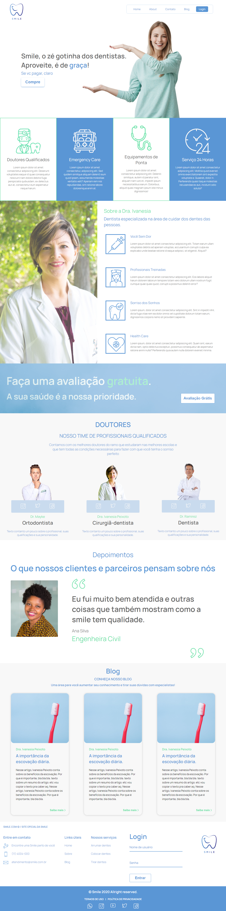

# smile


## Acesse o site [aqui](https://smile-clinica-odontologica.github.io/)

...ou então abaixo você pode ter um gostinho de como ficou...
<hr />

<hr />

## Conheça o Briefing

Empresária no ramo odontológico

A rede de clínicas odontológicas Smile é uma das mais conceituadas do país. Fundada em 1964, nasceu com o objetivo de trazer o que tem de mais sofisticado e moderno no tratamento aos seus cliente para proporcionar o melhor resultado possível. 

A Smile está reestruturando sua identidade visual. Com isto, a plataforma será seu principal meio de comunicação com seus clientes e novos visitantes.
 
VEJA OS PRINCIPAIS SERVIÇOS OFERECIDOS

- Estética
- Ortodontia
- Clínico
- Implantes

Além disso, a Smile oferece um modelo de Franquia para quem tem interesse em investir no setor de Odontologia.

Ela também conta com uma equipe de Dentistas colunistas que mantém o Blog sempre atualizado.

<hr />

## Como começar?
1. git clone https://github.com/VelterGarcias/smile.git
2. npm install
3. npm run sass
4. começe a programar

## Como atualizar seu projeto antes de dar um git push ou de começar a programar?
```
git pull origin master
```

## To-do

- [x] Colocar o favicon
- [x] Colocar link para voltar para a home tanto no logotipo do header, quanto no do footer
- [x] Definir quais páginas teremos
- [x] Ajustar as tag description das páginas
- [x] Fazer "deploy" no github pages


- [x] Concluir a criação do Layout
- [x] Fazer a divisão das tarefas

    
- [x] Designação de desenvolvimento em HTML e CSS
    
    -Home: João

    -Sobre: João

    -Blog: Myltiane

    -Login: Myltiane

    -Consulta Grátis: Vanessa
    
    -404: Vanessa

    -Franquias: Lucas

    -Serviços: Lucas

    -Cadastro: Velter

    -Perfil: Velter

    -Agende sua Consulta: Velter


## Bugs: 
- [x] menu mobile não tem overlay. 
- [x] botão login no mobile fica fora da visualização por conta do cabeçalho do Chrome. (Mas não tem como ver isso no Pc pq a visualização mobile não tem cabeçalho de endereço) kkk
- [x] Campo de data no mobile está estranho. (No Chrome pelo menos)
- [x] a cor do Focus ou hover dos time options está estranha no mobile.
- [x] a foto de fundo das minhas páginas era melhor que fosse a do bebê, coloquei a da médica e esqueci de trocar.
- [] melhorar pontuação no liteHouse.

- [] Se lembrarem de mais vão escrevendo...
